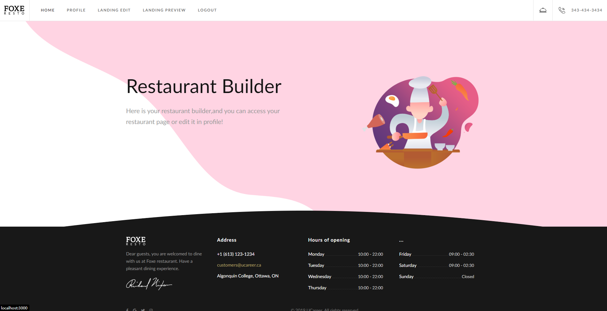
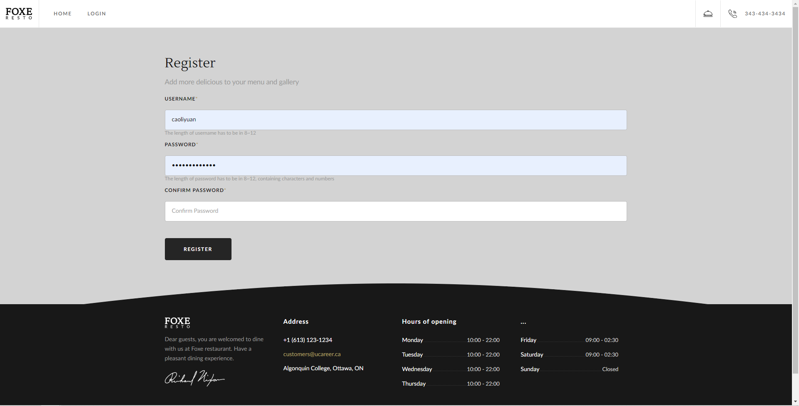
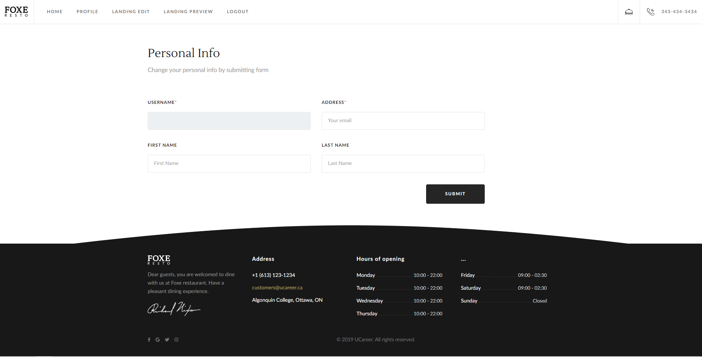
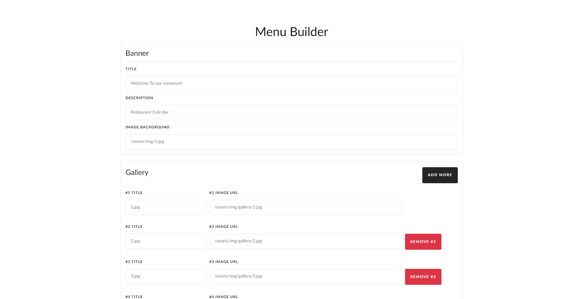

## Restaurant menu builder
This single page website is a team work project that provide a place for restaurant owners to build
 their menu introductions and dishes presentations. Here, people can register and login their own
  account and input their basic information. The essential function of the website is to add, delete, modify and search dishes in the menu. Enter the name, upload the picture, write descriptions and set up the price. Is that simple, right?
### Home

This is the screen shot of the home page of our website. Here you can see the header navigation, the main page content and the footer serving time and contact information.
### Register

To use the website, the first thing you need to do is register an account. The account will help you store your setting personally and you only need to enter your email and password to login next time. Here you have to follow the rule of setting password, which makes your password safe and hard to hack. You don't have to worry about the security becuase we use JWT to communicate with the back end server. Your personal information is invisible when transmitting.
### Profile

After you register and login, you will come to your profile page. Here you can modify your name, email and password.
### Editor

